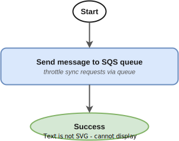

# Fastq Sync Manager

- [Overview](#overview)
- [Service State Flow](#service-state-flow)
  - [1. FastqSync request → SQS queue](#1-fastqsync-request--sqs-queue)
  - [2. Queue → Initialise task token](#2-queue--initialise-task-token)
  - [3. Launch requirements per fastq ID](#3-launch-requirements-per-fastq-id)
  - [4. Fastq state change → Token release](#4-fastq-state-change--token-release)
  - [5. External heartbeat monitor](#5-external-heartbeat-monitor)
- [Event Contract](#event-contract)
  - [Consumed Events](#consumed-events)
  - [Submitting a FastqSync Request](#submitting-a-fastqsync-request)
    - [FastqIdList method](#fastqidlist-method)
    - [FastqSetIdList method](#fastqsetidlist-method)
    - [Legacy method (deprecated)](#legacy-method-deprecated)
  - [Supported Requirements](#supported-requirements)
- [Infrastructure](#infrastructure)
  - [Stateful Resources](#stateful-resources)
  - [Stateless Resources](#stateless-resources)
  - [Stacks](#stacks)
- [CI/CD and Release Management](#cicd-and-release-management)
- [Related Services](#related-services)
- [Glossary & References](#glossary--references)

---

## Overview

The Fastq Sync Manager enables workflow orchestration services across the OrcaBus platform to pause execution until primary sequencing data (FASTQ files) meets specific readiness conditions.

Other step functions can "hang" at a point in their execution by sending a `FastqSync` event with a task token. The service registers the token, monitors the specified FASTQ IDs, and fires a `sendTaskSuccess` callback when all conditions are met.

Supported readiness conditions include:
- FASTQ has an active (unarchived) read set
- FASTQ has QC data
- FASTQ has fingerprint (NTSM) data
- FASTQ has file compression information
- FASTQ has read count information

The service uses a **task-token callback pattern** — callers provide an AWS Step Functions task token, and the service sends a callback when the data conditions are satisfied.

**Upstream**: Any OrcaBus service requiring FASTQ readiness (e.g. [Dragen WGTS DNA Pipeline Manager](https://github.com/OrcaBus/service-dragen-wgts-dna-pipeline-manager))
**Dependencies**: [Fastq Manager](https://github.com/OrcaBus/service-fastq-manager), [Fastq Unarchiving](https://github.com/OrcaBus/service-fastq-unarchiver)

---

## Service State Flow

The service orchestrates five Step Functions state machines that together drive a sync request from initial submission through to task token release.

### Events Overview


---

### 1. FastqSync request → SQS queue

**State machine**: [`send_fastq_sync_request_to_queue_sfn_template`](app/step-functions-templates/send_fastq_sync_request_to_queue_sfn_template.asl.json)



When a `FastqSync` event arrives on the EventBridge bus, this state machine forwards the request to an SQS queue for throttled processing. This ensures bursts of sync requests don't overwhelm downstream services.

---

### 2. Queue → Initialise task token

**State machine**: [`initialise_task_token_for_fastq_id_list_sfn_template`](app/step-functions-templates/initialise_task_token_for_fastq_id_list_sfn_template.asl.json)


Invoked by the `handleMessages` Lambda (which consumes SQS messages via durable execution), this state machine:

1. **Check requirements** — invokes the `checkFastqIdListAgainstRequirements` Lambda to verify the current state of each FASTQ ID. If the check fails (e.g. archived data without unarchiving permission), sends an immediate task failure.
2. **Early exit** — if all requirements are already satisfied, sends an immediate `sendTaskSuccess` and unlocks the callback.
3. **Register in DynamoDB** — stores the task token, fastq ID set, and requirements in the DynamoDB table. Enables the heartbeat scheduler.
4. **Launch requirements** — starts the `launchFastqListRowRequirements` sub-SFN for each FASTQ ID to kick off any needed jobs.
5. **Unlock callback** — releases the durable execution slot so the next queued request can proceed.

---

### 3. Launch requirements per fastq ID

**State machine**: [`launch_fastq_list_row_requirements_sfn_template`](app/step-functions-templates/launch_fastq_list_row_requirements_sfn_template.asl.json)


For each FASTQ ID, this state machine determines what jobs need to run:

1. **Get fastq and remaining requirements** — queries the Fastq Manager API for the current state and identifies which requirements are already met vs unsatisfied.
2. **Has readset?** — if the FASTQ has no read set, there's nothing to do (exits early).
3. **Needs unarchiving?** — if `hasActiveReadSet` is unsatisfied, launches an unarchiving job via the Fastq Unarchiving API.
4. **Launch requirement jobs** — for each unsatisfied requirement (QC, fingerprint, compression, read count), launches the appropriate job via the Fastq Manager API. Jobs that depend on read count information wait until that data is available.

---

### 4. Fastq state change → Token release

**State machine**: [`fastq_id_updated_sfn_template`](app/step-functions-templates/fastq_id_updated_sfn_template.asl.json)


Triggered when a `FastqStateChange` or `FastqUnarchivingJobStateChange` event arrives:

1. **Look up task tokens** — queries DynamoDB for any task tokens registered against the updated FASTQ ID.
2. **Check requirements per token** — for each token, validates whether the FASTQ ID now meets the token's requirements.
3. **Release satisfied tokens** — if all FASTQ IDs for a token meet requirements, sends `sendTaskSuccess` and cleans up DynamoDB entries.
4. **Launch remaining requirements** — if unsatisfied requirements remain, launches the requirements sub-SFN to kick off any newly possible jobs.

---

### 5. External heartbeat monitor

**State machine**: [`external_heartbeat_monitor_sfn_template`](app/step-functions-templates/external_heartbeat_monitor_sfn_template.asl.json)


Runs on a 15-minute schedule (enabled when tokens are registered, disabled when none remain):

1. **Scan active tokens** — reads all task tokens from DynamoDB.
2. **Check running jobs** — for each token, queries the Fastq Manager and Fastq Unarchiving APIs to see if any related jobs are still active.
3. **Send heartbeat** — if jobs are running (or randomly, to clear stale tokens), sends a heartbeat to keep the task token alive.
4. **Verify requirements** — if no jobs are running, re-checks whether all requirements are now met. Sends `sendTaskSuccess` if satisfied, or lets the token potentially time out if not.
5. **Disable scheduler** — if no tokens remain, disables the scheduled rule to avoid unnecessary invocations.

---

## Event Contract

### Consumed Events

| DetailType                       | Source                     | Schema                                                                          | Description                                         |
|----------------------------------|----------------------------|---------------------------------------------------------------------------------|-----------------------------------------------------|
| `FastqSync`                      | `any`                      | [fastq-sync-request-list](app/event-schemas/fastq-sync-request-list.schema.json) | Sync request from callers with task token           |
| `FastqStateChange`               | `orcabus.fastqmanager`     | —                                                                               | Fastq state updates (readset added, QC updated, etc.) |
| `FastqUnarchivingJobStateChange` | `orcabus.fastqunarchiving` | —                                                                               | Unarchiving job succeeded                           |

### Submitting a FastqSync Request

A `FastqSync` event is submitted by any service that needs to wait for FASTQ readiness. The event is sent to the `OrcaBusMain` EventBridge bus with a task token.

#### FastqIdList method

```json
{
  "EventBusName": "OrcaBusMain",
  "Source": "orcabus.myservice",
  "DetailType": "FastqSync",
  "Detail": {
    "taskToken": "<step-functions-task-token>",
    "payload": {
      "fastqIdList": [
        "fqr.12345",
        "fqr.67890"
      ],
      "requirements": {
        "hasActiveReadSet": true,
        "hasQc": true
      },
      "forceUnarchiving": true
    }
  }
}
```

#### FastqSetIdList method

When providing fastq set IDs instead of individual fastq IDs, the service resolves them to individual IDs internally:

```json
{
  "EventBusName": "OrcaBusMain",
  "Source": "orcabus.myservice",
  "DetailType": "FastqSync",
  "Detail": {
    "taskToken": "<step-functions-task-token>",
    "payload": {
      "fastqSetIdList": [
        "fqs.12345",
        "fqs.67890"
      ],
      "requirements": {
        "hasActiveReadSet": true
      },
      "forceUnarchiving": false
    }
  }
}
```

#### Legacy method (deprecated)

The legacy method uses `camelCase` detail type and a flat structure without `payload`:

```json
{
  "EventBusName": "OrcaBusMain",
  "Source": "any",
  "DetailType": "fastqSync",
  "Detail": {
    "taskToken": "<step-functions-task-token>",
    "fastqSetId": "fqs.12345",
    "requirements": {
      "hasActiveReadSet": true
    },
    "forceUnarchiving": true
  }
}
```

### Supported Requirements

| Requirement                      | Description                                                    |
|----------------------------------|----------------------------------------------------------------|
| `hasActiveReadSet`               | FASTQ is unarchived and has an active read set                 |
| `hasQc`                          | FASTQ has QC metrics available                                 |
| `hasFingerprint`                 | FASTQ has NTSM fingerprint data                                |
| `hasFileCompressionInformation`  | FASTQ has file compression metadata                            |
| `hasReadCountInformation`        | FASTQ has read count and base count estimates                  |

---

## Infrastructure

The service is deployed via AWS CDK. Resources are split into two stacks: stateful (data/config) and stateless (compute/events).

Event bus: `OrcaBusMain`

### Stateful Resources

- **DynamoDB table** (`FastqSyncTaskTokenTable`) — stores task token ↔ fastq ID mappings with TTL-based expiry (7 days)
- **SQS queue** (`FastqSyncRequestQueue`) — throttles incoming sync requests with configurable concurrency (default: 20)

### Stateless Resources

- **Lambda functions** (Python 3.14) — one per task; see [`app/lambdas/`](app/lambdas/)
  - `handleMessages` — SQS consumer using durable execution SDK
  - `checkFastqIdListAgainstRequirements` — validates fastq state against requirements
  - `getFastqAndRemainingRequirements` — queries fastq API for current state
  - `launchRequirementJob` — kicks off QC/fingerprint/unarchiving jobs
  - `checkRunningJobsForFastqIdList` — checks for active jobs across services
  - `unlockCallbackId` — releases durable execution callback slots
- **Step Functions state machines** — five ASL templates in [`app/step-functions-templates/`](app/step-functions-templates/)
- **EventBridge rules** — route `FastqSync`, `FastqStateChange`, and `FastqUnarchivingJobStateChange` events to state machines
- **EventBridge scheduled rule** — triggers heartbeat monitor every 15 minutes (enabled/disabled dynamically)
- **Lambda layer** (`fastq_sync_tools`) — shared utilities for requirement checking and job launching

### Stacks

The CDK project deploys a CodePipeline in the toolchain account that promotes changes to `beta`, `gamma`, and `prod`.

```sh
# List stateless stacks
pnpm cdk-stateless ls
# OrcaBusStatelessServiceStack
# OrcaBusStatelessServiceStack/DeploymentPipeline/OrcaBusBeta/DeployStack
# OrcaBusStatelessServiceStack/DeploymentPipeline/OrcaBusGamma/DeployStack
# OrcaBusStatelessServiceStack/DeploymentPipeline/OrcaBusProd/DeployStack
```

---

## CI/CD and Release Management

All changes merged to `main` are automatically built and deployed through the CodePipeline to `beta` → `gamma` → `prod`.

GitHub Actions CI runs `make check` and `pnpm test` on pull requests.

---

## Related Services

| Role                | Service                                                                                          |
|---------------------|--------------------------------------------------------------------------------------------------|
| FASTQ state         | [Fastq Manager](https://github.com/OrcaBus/service-fastq-manager)                               |
| Unarchiving         | [Fastq Unarchiving](https://github.com/OrcaBus/service-fastq-unarchiver)                        |
| Upstream caller     | [Dragen WGTS DNA](https://github.com/OrcaBus/service-dragen-wgts-dna-pipeline-manager)          |
| Upstream caller     | [Analysis Glue](https://github.com/OrcaBus/service-analysis-glue)                               |

---

## Glossary & References

- Platform glossary: [OrcaBus wiki](https://github.com/OrcaBus/wiki/blob/main/orcabus-platform/README.md#glossary--references)
- For development setup, build commands, project structure, and conventions see the [steering docs](.kiro/steering/).

| Term                  | Description                                                                                    |
|-----------------------|------------------------------------------------------------------------------------------------|
| Task Token            | An AWS Step Functions token used to resume a paused execution via callback                      |
| Fastq ID (`fqr.*`)   | Identifier for an individual FASTQ record                                                      |
| Fastq Set ID (`fqs.*`) | Identifier for a group of related FASTQ records                                              |
| Requirements          | Boolean conditions (e.g. `hasActiveReadSet`) that must be true before callback fires          |
| Durable Execution     | Lambda pattern using `aws-durable-execution-sdk-python` for reliable callback-based processing |
| Heartbeat             | Periodic signal sent to keep a task token alive while jobs are still running                    |
